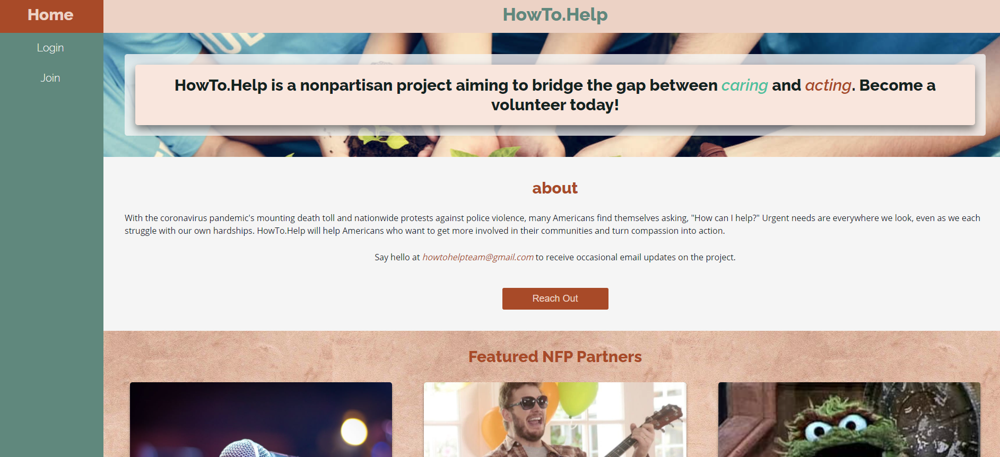
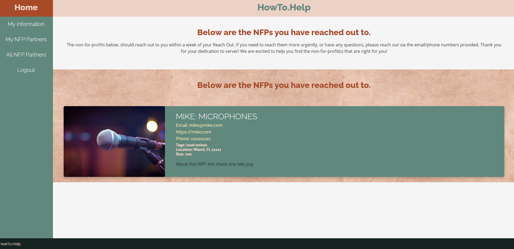
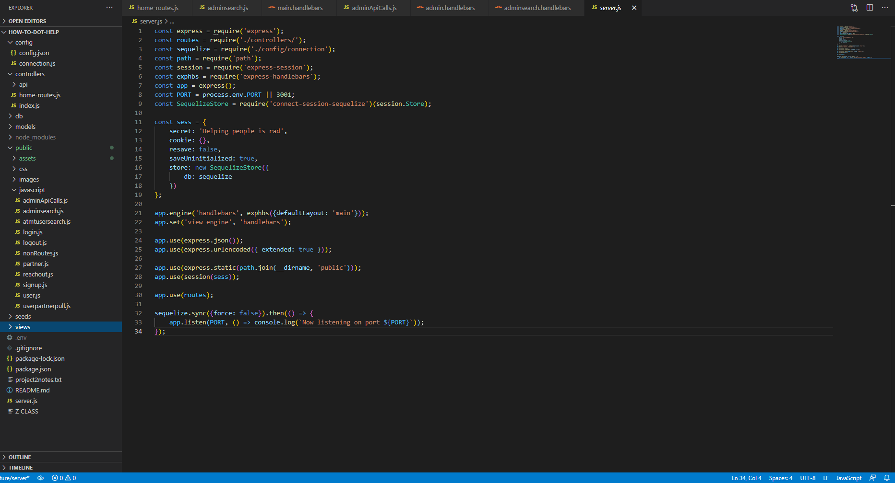
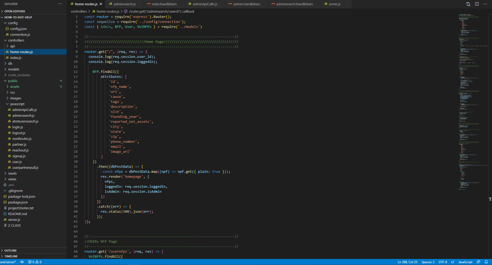

# how-to-dot-help

## Description
How-To-Dot-Help is a website portal connecting potential volunteers with smaller organizations that are looking for the additional help. On this website, users will be able to create an account protected by modern security features and indicate which organizations they may be interested in volunteering for. On the other side of the platform the staff of How To Dot Help will connect these prospective volunteers with the organization via phone, email, or text message depending on the method selected by the volunteer.

## Table of Contents

 Table of Contents 

    *[Installation](#Installation)
    
    *[Built With](#built-with)

    *[Pictures](#pictures)

    *[License](#license)

    *[Contact](#contact-us)
        *[Creators](#creators)

 
 
 

## Installation
Hosting for the application will be located at [Heroku](https://how-to-dot-help.herokuapp.com). If copying the files directly, a list of the packages and applications used are listed below.

 
 
 

## Built With
    * HTML
    * CSS
    * JavaScript
    * [jQuery](https://jquery.com/)
    * [NPM](https://www.npmjs.com/)
        *[bcrypt](https://www.npmjs.com/package/bcrypt)
        *[connect-session-sequelize](https://www.npmjs.com/package/connect-session-sequelize)
        *[dotenv](https://www.npmjs.com/package/dotenv)
        *[express](https://www.npmjs.com/package/express)
        *[express-handlebars](https://www.npmjs.com/package/express-handlebars)
        *[express-session](https://www.npmjs.com/package/express-session)
        *[handlebars](https://www.npmjs.com/package/handlebars)
        *[sequelize](https://www.npmjs.com/package/sequelize)
        *[mysql2](https://www.npmjs.com/package/mysql2)

 
 
 

## Usage
    
    
    
    

 
 
 

## License
We are operating with an MIT license, for more information [see the full language](https://choosealicense.com/licenses/mit)

 
 
 

## Contributing
  Please follow the standard Contributor Covenant when looking to make any additions to this project. The Standard Contributor Covenant can be found at [https://www.contributor-covenant.org/](https://www.contributor-covenant.org/)

 
 
 

## Creators
 

* **Aaron Geiger** [GitHub](https://github.com/geigea84), [geigea84@gmail.com](mailto:geigea84@gmail.com)

* **Brent Johnson** [GitHub](https://github.com/uberbrent), [brentjohnsondev@gmail.com](mailto:brentjohnsondev@gmail.com)

* **Catherine Sibley** [GitHub](https://github.com/cgsdesign), [catherine.lea.graham@gmail.com](mailto:catherine.lea.graham@gmail.com)

* **Darryl Simpson** [GitHub](https://github.com/DarrylSimpson) , [Darryl.Simpson0793@gmail.com](mailto:Darryl.Simpson0793@gmail.com)
